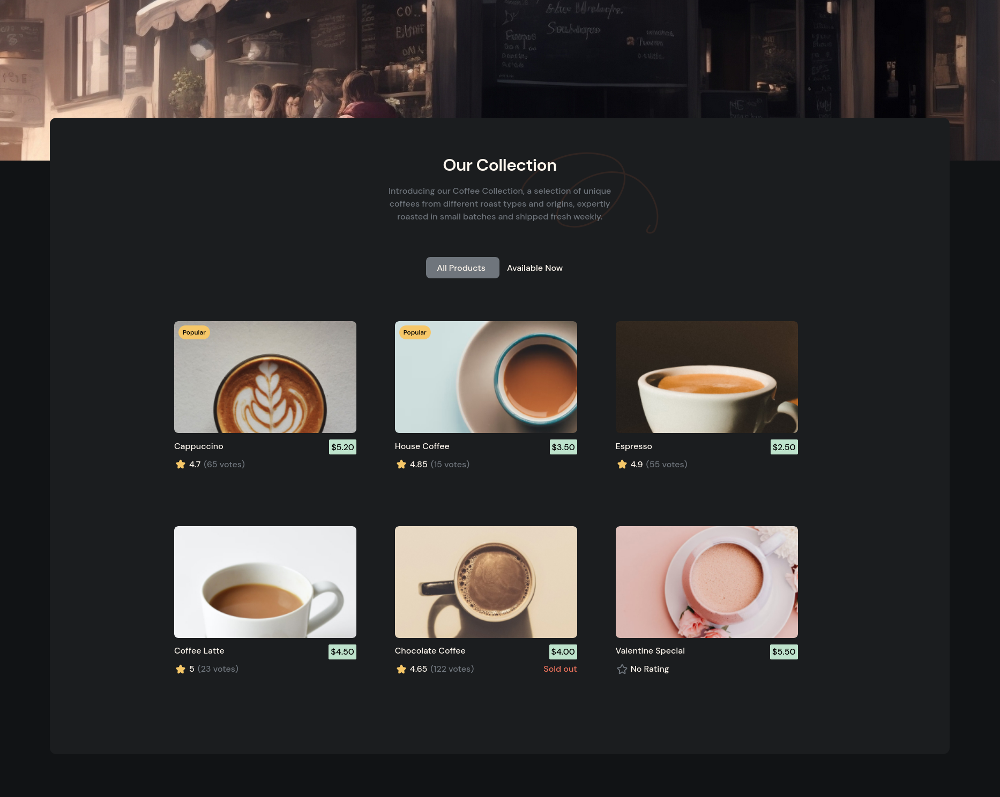
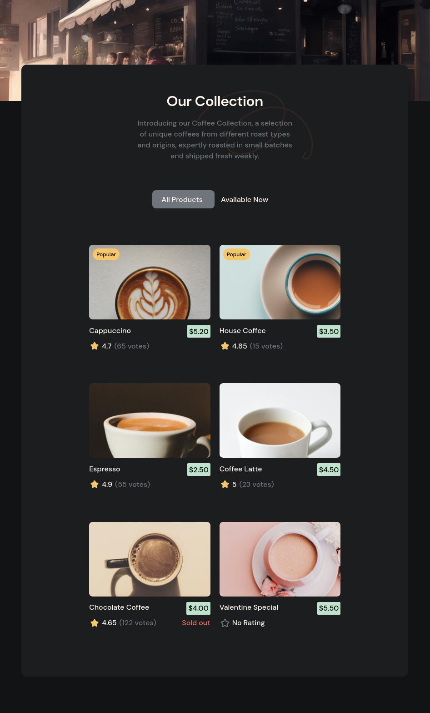
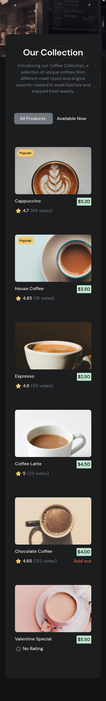

<h1 style="text-align:center">Simple Coffee Listing</h1>
<h2 style="text-align:center">Challenge from <a href="https://devchallenges.io/challenge/45">devChallenges.io</a></h2>

Build using: <a href="https://react.dev/" target="_blank">React JS </a>and <a href="https://tailwindcss.com/" target="_blank">TailwindCSS</a> .

    <a href="https://github.com/sreehariv-code/simple-coffee-listing">Code</a>
    

    <a href="https://simple-coffee-listing-omega.vercel.app/" target="_blank">Demo</a>

<h3>Preview</h3>

Desktop

Tablet

Mobile

